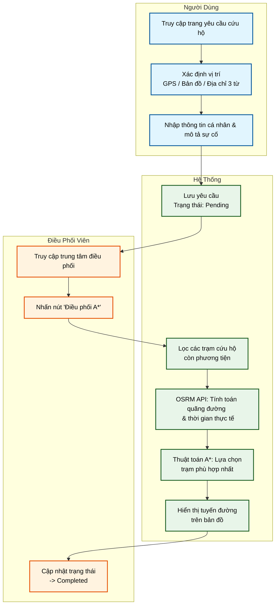
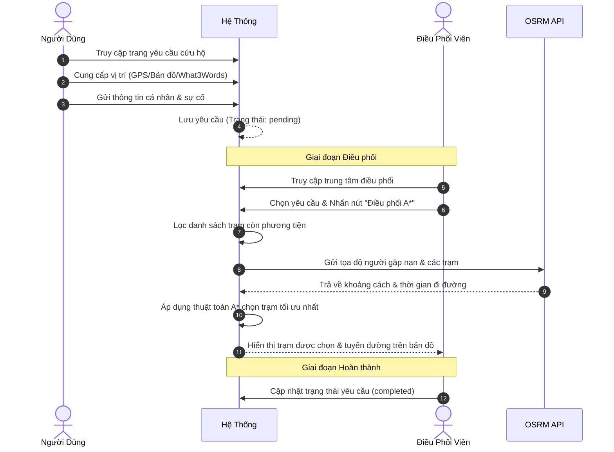

# Sơ đồ End-to-End: Hệ Thống Điều Phối Cứu Hộ Thông Minh

Dưới đây là sơ đồ luồng hoạt động (End-to-End Flow) của hệ thống điều phối cứu hộ. Sơ đồ được biểu diễn dưới hai dạng: Flowchart (Sơ đồ khối) và Sequence Diagram (Sơ đồ tuần tự).

## 1. Flowchart (Sơ đồ khối)
Sơ đồ này thể hiện các bước nối tiếp nhau trong hệ thống theo từng giai đoạn.

## 2. Sequence Diagram (Sơ đồ tuần tự)
Sơ đồ này thể hiện sự tương tác giữa các tác nhân (Người Dùng, Hệ Thống, Điều Phối Viên, và OSRM API) theo trình tự thời gian.

